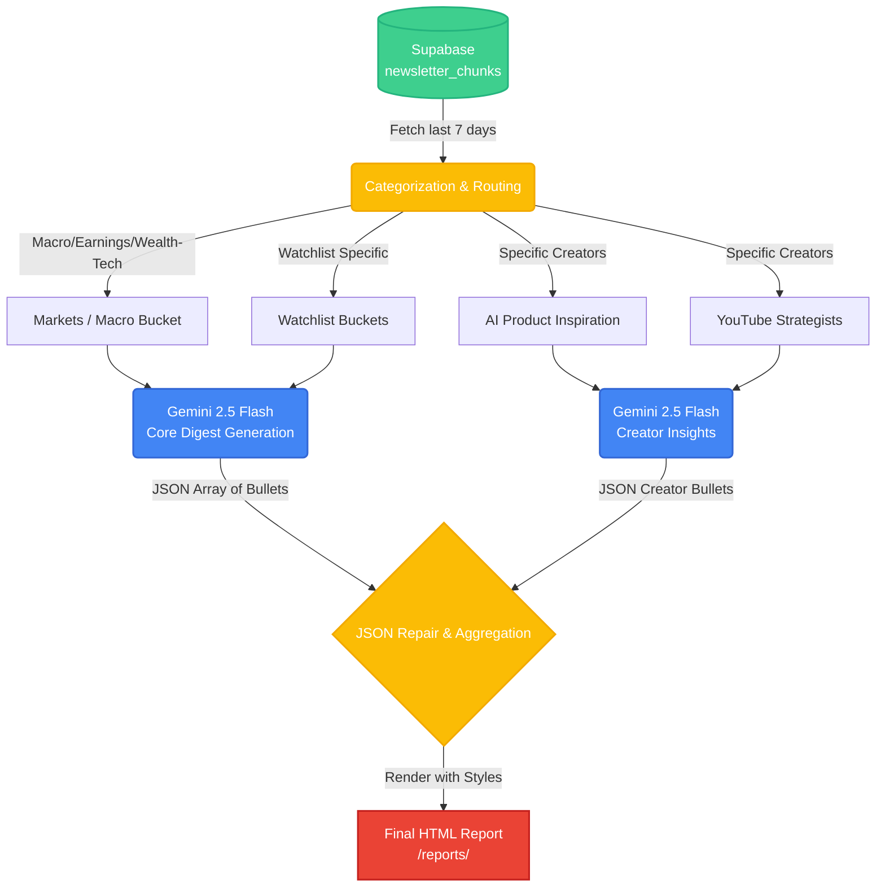

# 19_weekly-content-digest

This skill acts as a weekly digest aggregator. It pulls all newsletter and YouTube chunks added to the `newsletter_chunks` table over the last N days, categorizes them, and sends them to Gemini 2.5 Flash to generate a unified, beautiful HTML report.

## 📊 Data Flow Architecture

The following diagram illustrates how data is extracted, processed, and transformed into the final digest.



## ⚙️ How it Works

1. **Query**: Connects to the Market Data Supabase and queries `newsletter_chunks` (joined with `newsletter_inbox`) for records where `published_at` is within the last N days.
2. **Categorize**: 
   - Uses a hardcoded `PRODUCT_INSPIRATION` and `YOUTUBE_STRATEGISTS` list to deterministically route specific creators.
   - Groups macro, earnings, and wealth-tech into a general `markets/macro` bucket.
   - Passes remaining chunks into specific watchlist buckets (e.g., `watchlist/peptides`).
3. **Generate**: Passes the grouped buckets into the Gemini 2.5 Flash LLM, asking it to synthesize market sentiment, hot sectors, and product ideas into actionable JSON arrays.
4. **Resilience**: Features automatic JSON repair (handling trailing commas and unescaped newlines) and 3x exponential backoff retries for LLM stability.
5. **Save**: Outputs a fully stylized HTML report to the local `/reports/` folder, safely escaping user content to prevent XSS.

## 🚀 Setup & Usage

Ensure your `.env` file (located in `invest_analysis-main/research-meeting-skill/config/.env` or the project root) contains:

```bash
SUPABASE_URL=https://<your-project>.supabase.co
SUPABASE_SERVICE_KEY=your-service-role-key
GEMINI_API_KEY=your-gemini-api-key
```

Install dependencies:
```bash
pip install -r requirements.txt
```

### Commands

**Generate a report from live Supabase data (last 7 days):**
```bash
python scripts/generate_weekly_digest.py
```

**Generate a report looking back 14 days:**
```bash
python scripts/generate_weekly_digest.py --days 14
```

**Custom Output Directory:**
```bash
python scripts/generate_weekly_digest.py --output-dir /path/to/save
```

**Test locally without hitting Supabase (uses mock_data/chunks.json):**
```bash
python scripts/generate_weekly_digest.py --local-mock
```

**Dry-run to see which sources will be categorized where (no LLM usage):**
```bash
python scripts/generate_weekly_digest.py --dry-run
```

## ⏰ Automation

To run this automatically every Friday at 08:00 AM on Windows:
1. Right-click `schedule_friday.bat`
2. Select **Run as Administrator**
3. The task `KasonaWeeklyDigest` will be registered in the Windows Task Scheduler.
